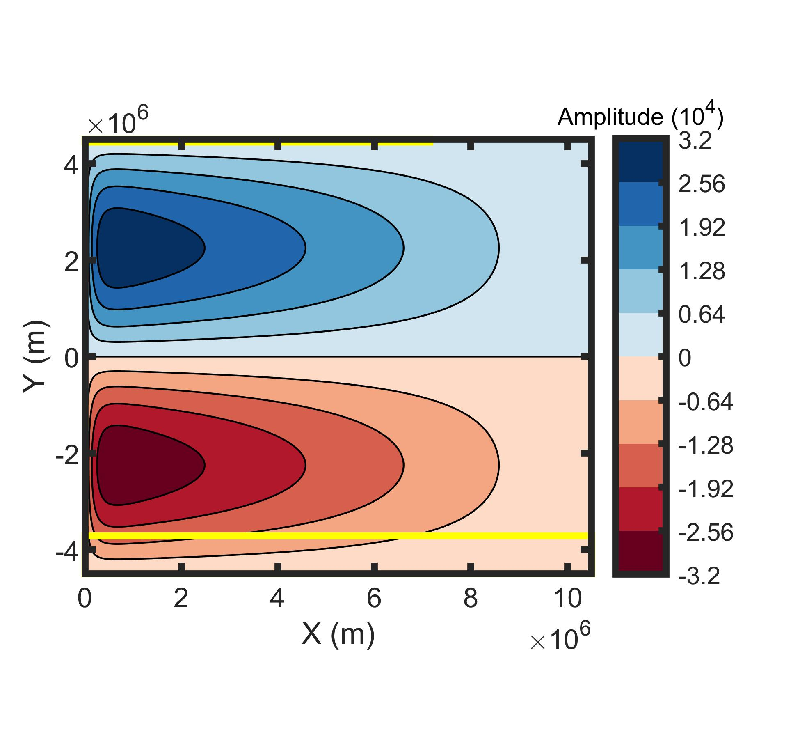

# Python Version

1. model2D.py is the main entrance for this model. model 2D.py call each funcitons and acquire the intermediate results for each function.

2. PsiDef.py defines the stream funciton for this isopycnal layer. It is a strommel gyre which is shown in following figure:

3. VelCalc.py calculates the velocity profiles for SUDM discretization scheme. SUDM stands for second upwind differencing scheme which performs better than FTCS (forward time central space).

4. WeightCal.py applied the SUDM discretization scheme and make sure the dt follows the Von Neumann stability and also decreases potential numerical diffusion. After some cleaning ups, we get the coefficient (Dx, Dy) for each boxes.

5.InitCon.py set up the boundary condition for the exposure surface for the desired isopycnal surface. Also, some initial conditions are set here and some isotopic fractionation factors are set in this part.

6. AdcDiff.py is the slowest part which performs the iteration and get the state solution. Box model with 4 neighbors.